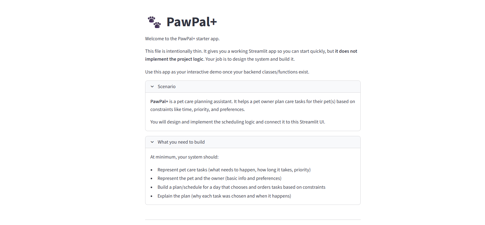
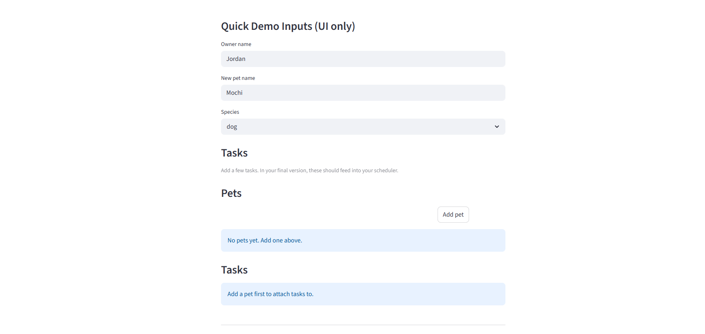

# PawPal+ (Module 2 Project)

You are building **PawPal+**, a Streamlit app that helps a pet owner plan care tasks for their pet.

## Scenario

A busy pet owner needs help staying consistent with pet care. They want an assistant that can:

- Track pet care tasks (walks, feeding, meds, enrichment, grooming, etc.)
- Consider constraints (time available, priority, owner preferences)
- Produce a daily plan and explain why it chose that plan

Your job is to design the system first (UML), then implement the logic in Python, then connect it to the Streamlit UI.

## What you will build

Your final app should:

- Let a user enter basic owner + pet info
- Let a user add/edit tasks (duration + priority at minimum)
- Generate a daily schedule/plan based on constraints and priorities
- Display the plan clearly (and ideally explain the reasoning)
- Include tests for the most important scheduling behaviors

## Getting started

### Setup

```bash
python -m venv .venv
source .venv/bin/activate  # Windows: .venv\Scripts\activate
pip install -r requirements.txt
```

### Suggested workflow

1. Read the scenario carefully and identify requirements and edge cases.
2. Draft a UML diagram (classes, attributes, methods, relationships).
3. Convert UML into Python class stubs (no logic yet).
4. Implement scheduling logic in small increments.
5. Add tests to verify key behaviors.
6. Connect your logic to the Streamlit UI in `app.py`.
7. Refine UML so it matches what you actually built.

## Smarter Scheduling

This project adds a few incremental scheduler improvements:

- Sorts tasks by earliest time before building the plan.
- Filters tasks by pet and completion status for targeted views.
- Automatically creates a stub for the next occurrence when a recurring task is completed (caller assigns an id and adds it to the pet).
- Performs lightweight conflict detection for exact start-time matches and returns warnings instead of failing.

## Features

- Sorting by time: tasks are sorted by earliest start time before display.
- Priority-based placement: higher-priority tasks are scheduled first.
- Recurrence support: daily/weekly tasks produce next-occurrence stubs when completed.
- Filtering: view tasks by pet or completion status.
- Conflict warnings: lightweight detection for tasks sharing the same start time.

## Testing PawPal+

Run the tests with:

```bash
python -m pytest
```

Tests cover:
- Basic task operations (marking complete)
- Pet/task CRUD
- Sorting tasks by time
- Recurrence behavior (daily tasks produce next occurrence)
- Conflict detection for identical start times

Confidence level: ★★★★☆ (4/5) — core behaviors tested, more edge cases could be added for complex overlaps and timezone handling.

## Demo




